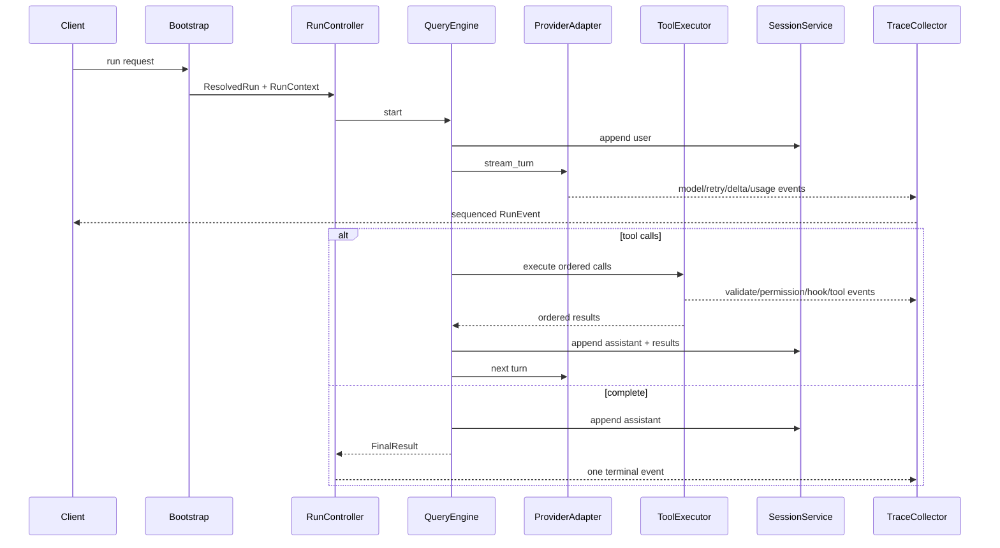

# NonoClaw 精干化与体验提升 Design

## Overview

本设计不删除现有功能，而是通过**统一所有权、补齐半成品、消除重复状态、拆解超大模块和建立可观察事件流**，让丰富功能运行在一个精干内核上。

核心判断标准：

- 用户入口和能力是否完整保留。
- 同一职责是否只有一个权威实现。
- 失败、等待、重试和自动行为是否可见。
- 呼吸动画是否准确表达系统状态且保持流畅。
- 重构是否降低维护复杂度，而不是把复杂度转移到新抽象。

## Design Principles

1. **Preserve behavior, consolidate implementation**：保留行为，合并实现。
2. **One owner per concern**：每项核心职责只有一个所有者模块。
3. **Structured events first**：CLI、Web、trace 和呼吸体验共享结构化事件。
4. **Complete or reject explicitly**：声明的能力必须完整实现，否则加载时明确报错。
5. **Incremental replacement**：先建立契约测试，再逐条替换，不做大爆炸重写。
6. **Transparency without chain-of-thought**：展示事实、状态和决策结果，不展示隐藏思维链。

## Feature Preservation Map

| 功能域 | 必须保留 | 改善方向 |
|---|---|---|
| 运行模式 | headless、Web、remote server/client、MCP server | 共用 bootstrap 与配置 |
| 模型 | 多 Profile、Anthropic/OpenAI、compact/doc model | Client Factory、Provider parity |
| Agent | 主 Agent、Agent tool、Coordinator、多子 Agent | 限深、取消、trace、统一构造 |
| 工具 | 全部内建工具、MCP、后台 Bash、Todo/Task | ToolExecutor、真实并发 cap、共享 store |
| 扩展 | Hooks、Skills、Profiles、Plugins、MCP | 明确职责、补齐 action、冲突诊断 |
| 会话 | JSONL、resume/continue/list/clear、compact | 单写通道、版本和恢复 |
| Web | HTTP/WS、PWA、移动同步、QR/tunnel | 拆模块、鉴权明确、有序同步 |
| 媒体 | 上传、文档图片、STT、ElevenLabs | 独立 service、统一错误 |
| 工程视图 | FileTree、Insight、Git、Commit | 数据服务去重、按需刷新 |
| 前端 | 模型/权限、multi-run、工具卡、Markdown | 单一状态模型、性能和可达性 |
| 特色 | 技术信息、BreathField | Trace timeline、事件驱动呼吸状态机 |

任何实施任务都必须引用此表；如果一个改动无法说明功能如何保留，则不得合并。

## Target Architecture

保留五个 Rust crate 和 React 前端，但重新明确内部所有权：

```text
nonoclaw-core
  Domain types
  ├── Message / ContentBlock / Usage
  ├── Permission model
  └── RunEvent / RunId / EventSequence

nonoclaw-api
  Provider runtime
  ├── ProviderAdapter
  ├── AnthropicAdapter
  ├── OpenAiAdapter
  ├── ClientFactory
  └── Retry / capability / stream normalization

nonoclaw-tools
  Tool runtime
  ├── ToolRegistry
  ├── ToolExecutor
  ├── PermissionGate
  ├── shared TaskStore
  ├── BackgroundTaskManager
  ├── built-in tools
  └── MCP client/server

nonoclaw-engine
  Agent runtime
  ├── QueryEngine
  ├── RunContext / RunController
  ├── PromptBuilder / ContextProvider
  ├── SessionService / Compactor
  ├── ExtensionRuntime
  │   ├── Hooks
  │   ├── Skills
  │   ├── Profiles
  │   └── Plugins
  └── TraceCollector

nonoclaw CLI
  Application shell
  ├── Bootstrap / ResolvedConfig
  ├── Headless
  ├── Remote
  ├── MCP serve
  └── Web
      ├── protocol
      ├── connection
      ├── run_handler
      ├── session_hub
      ├── project_service
      ├── upload_service
      ├── speech_service
      └── static_service

frontend
  UI shell
  ├── protocol client
  ├── normalized store slices
  ├── chat + tool timeline
  ├── technical trace
  ├── project/git/session surfaces
  └── BreathController + BreathField
```

## Canonical Ownership

| Concern | Canonical owner | 禁止重复的位置 |
|---|---|---|
| 配置合并与来源 | `ResolvedConfig` | CLI/Web 各自解析 |
| 模型 Client 构造 | `ClientFactory` | `serve_http` 临时 new/set_var |
| Provider 转换 | `nonoclaw-api` adapter | engine/frontend provider 分支 |
| 工具 pipeline | `ToolExecutor` | QueryEngine 内复制权限/Hook 流程 |
| 运行取消 | `RunController` | Web handler 多组松散 handle/token |
| 任务状态 | shared `TaskStore` | Todo 与 Task 各自存储 |
| 会话读写 | `SessionService` | handler 直接拼接 JSONL |
| 项目信息 | `ProjectService` | handshake/run/refresh 重复 gather |
| 事件协议 | `RunEvent` + wire envelope | 手写多套序列化字段 |
| 前端持久会话 | server JSONL | localStorage 长期副本 |
| 呼吸状态 | `BreathController` | 各组件直接 pulse/flare |

## Data Flow



所有运行模式只改变输入/输出 adapter，不改变中间执行语义。

## Core Components

### 1. ResolvedConfig and Bootstrap

`ResolvedConfig` 保存最终值和来源：

```rust
pub struct Resolved<T> {
    pub value: T,
    pub source: ConfigSource,
}

pub struct ResolvedConfig {
    pub models: Vec<ModelProfile>,
    pub active_model: Resolved<String>,
    pub permissions: Resolved<PermissionConfig>,
    pub limits: Resolved<RunLimits>,
    pub mcp_servers: Vec<ResolvedMcpServer>,
    pub hooks: HookConfig,
    pub media: MediaConfig,
    pub web: WebConfig,
}
```

保留现有配置来源和优先级，但所有入口先走同一个 bootstrap。配置合并函数必须纯化，不能在解析阶段修改 process env。环境变量只作为输入源读取。

`ClientFactory` 根据 ModelProfile 和用途（conversation、compact、document、subagent）创建或缓存 Client。模型切换不会调用 `set_var`，因此并发 session 不会互相污染。

### 2. ProviderAdapter

统一接口：

```rust
#[async_trait]
pub trait ProviderAdapter: Send + Sync {
    fn capabilities(&self) -> ProviderCapabilities;
    async fn stream_turn(
        &self,
        request: TurnRequest,
        sink: EventSink,
        cancel: CancellationToken,
    ) -> Result<TurnOutput>;
}
```

两种 adapter 统一输出：message start、text/thinking delta、tool start/input delta、block stop、usage、stop reason 和 error。OpenAI 实现真实 SSE streaming；无法支持的字段进入 capability，不静默丢弃。

重试只覆盖流开始前的瞬时失败，使用 jittered exponential backoff 和总上限。每次重试产生 trace event。

### 3. RunContext and RunController

```rust
pub struct RunContext {
    pub run_id: RunId,
    pub session_id: String,
    pub cwd: PathBuf,
    pub model: ModelRef,
    pub limits: RunLimits,
    pub cancel: CancellationToken,
    pub trace: TraceSink,
}
```

`RunController` 拥有顶层 task、事件 relay、子 Agent token 树和终态提交。取消是幂等操作，保证只产生一次 `RunFinished`。Web、headless 和 remote 都通过该控制器运行。

### 4. ToolExecutor

`QueryEngine` 负责决定何时执行工具，`ToolExecutor` 负责如何执行：

```text
lookup
→ schema/semantic validation
→ permission gate
→ PreToolUse hooks
→ bounded scheduling
→ Tool::call
→ PostToolUse or PostToolUseFailure hooks
→ size normalization
→ ordered result assembly
→ trace
```

并发安全工具使用 `Semaphore` 或 `buffer_unordered(cap)` 实现真实上限；非安全工具形成串行 barrier。结果通过原始 index 重排，确保模型、session 和 UI 一致。

保留所有工具 API。TodoWrite 与 Task* 仅共享底层 `TaskStore` 和状态转换，仍保留不同工具名和适合各自场景的 schema。

后台 Bash 由 `BackgroundTaskManager` 管理，明确拥有 child process、状态、通知和回收。停止 session 或进程退出时必须清理。

### 5. ExtensionRuntime

扩展机制不合并成一个含糊系统，而是共享发现、来源和诊断基础设施：

```rust
pub struct ExtensionDescriptor {
    pub kind: ExtensionKind,
    pub name: String,
    pub source: PathBuf,
    pub precedence: u32,
    pub version: Option<String>,
    pub status: ExtensionStatus,
}
```

- Profile：覆盖 prompt、工具和权限策略。
- Skill：提供可激活工作流与参考内容。
- Plugin：打包 Skills/配置等扩展资产。
- Hook：响应确定生命周期。
- MCP：提供进程外工具。

Hooks 建立 action trait：CommandAction、PromptAction、HttpAction。若一种 action 未编译或未实现，加载配置时直接报 capability error。Hook 返回统一 decision，支持 allow、deny、ask 和 updated input；所有已声明的 HookType 都必须补齐真实调用点。仅供内部使用的生命周期也必须明确标记并测试，不能以删除声明代替实现完善。

Skills 的路径、trigger、slash、动态发现和热重载均保留，激活时发出包含 reason/source/version 的事件。覆盖冲突进入诊断面板而非静默处理。

### 6. SessionService

每个 session 使用 actor 或单 writer channel：

```text
SessionCommand::{Append, ReplaceAfterCompact, Clear, Snapshot, Close}
```

writer 负责内存 revision 和 JSONL 顺序一致。每次 snapshot 带 `revision`；peer 同步和重连使用 revision/event sequence 判断是否接收，替代全局 `skipOneLoad`。

继续兼容旧 JSONL。读取时跳过坏行、修复 tool pair，并生成 `SessionRepair` trace。Clear 先取消 run，提升 revision，再清空，旧 revision 的事件由前端丢弃。

### 7. Web Service Decomposition

`serve_http.rs` 当前承担协议、session、run、上传、语音、静态资源、Git/ProjectInfo 和 tunnel 协调，应按职责拆分，但保留所有路由与协议能力。

关键规则：

- 不持有 session registry 锁执行 WebSocket send 或 project gather。
- ProjectInfo 由 `ProjectService` 生成，可按 git/config/skills version 缓存。
- upload/speech 是独立 service，错误统一映射为 API error。
- session peer hub 只负责订阅和广播版本化事件。
- auth policy 明确区分 localhost 与 public/tunnel；公网访问必须校验 token。

### 8. Wire Protocol

使用统一 envelope：

```rust
pub struct EventEnvelope<T> {
    pub protocol_version: u16,
    pub run_id: Option<RunId>,
    pub session_id: String,
    pub session_revision: u64,
    pub sequence: u64,
    pub timestamp_ms: u64,
    pub event: T,
}
```

保留现有 ClientMsg/ServerMsg 功能，逐步迁移到 envelope。Rust 类型和 TypeScript 类型通过 schema 生成或 checked fixture 保持一致。未知新事件由旧客户端安全忽略。

## Technical Transparency Design

### Trace Model

`RunEvent` 同时驱动 CLI、WebSocket、trace 和 BreathController：

```text
RunStarted
ContextPrepared { estimated_tokens, context_window, tool_count, skill_count }
ModelRequestStarted { requested_model, provider, turn }
ModelResolved { requested_model, actual_model }
RetryScheduled { attempt, delay, category }
TextDelta / ThinkingState
ToolQueued / ToolValidation / PermissionRequested / PermissionResolved
HookStarted / HookFinished
ToolStarted / ToolFinished
SubagentStarted / SubagentFinished
CompactionStarted / CompactionFinished
UsageUpdated
RecoveryApplied
RunFinished { reason, duration, totals }
```

默认聊天只展示回答和工具卡。技术面板按时间线显示摘要，详情按需展开。Trace JSON 导出前执行字段级脱敏和大内容截断。

不展示 hidden chain-of-thought；thinking 只显示“模型正在思考”、耗时和 Provider 能力，除非 Provider 返回的是明确允许展示的普通内容块。

### Transparency UI

InsightRail 演进为可折叠 Technical Trace，而不是删除：

- 顶部：实际模型、turn、上下文占用、总耗时、token/cache。
- 时间线：工具、权限、Hook、重试、压缩、子 Agent。
- 诊断：配置来源、MCP/Plugin/Skill 状态、降级和自动修复。
- 导出：脱敏 trace JSON。

信息分三层：默认状态、展开摘要、开发者详情。技术透明不能造成主聊天噪音。

## Breathing Experience Design

### State Machine

```text
Idle
Connecting
Thinking
Streaming
ToolRunning
WaitingPermission
WaitingQuestion
Compacting
SubagentRunning
Success
Error
Reconnecting
```

`BreathController` 订阅 RunEvent 和 connection event，计算唯一 `BreathState`。组件不得直接调用 BreathField；现有 `pulse/flare/settle` 调用迁移为 controller action。

状态可映射到有限视觉参数：

```ts
interface BreathVisualState {
  amplitude: number
  frequency: number
  turbulence: number
  warmth: number
  flare: number
  paused: boolean
}
```

状态过渡使用连续插值；token pulse 进入节流的能量累加器，不写入 React state。动画由单一 `requestAnimationFrame` 驱动，页面隐藏时暂停或降频。

### Interaction Rules

- Idle：慢、轻、稳定。
- Thinking/Streaming：呼吸略加快，token 只产生细微纹理。
- ToolRunning/SubagentRunning：开始与完成时短 flare，持续期稳定。
- Waiting：频率降低并保持悬停，配合文字说明等待对象。
- Compacting：缓慢收拢再恢复。
- Success：一次舒展后回到 Idle。
- Error：一次克制收缩，不持续闪烁。
- Reconnecting：低频断续，并保持界面可操作。

支持 `prefers-reduced-motion`；颜色不是唯一状态载体。目标是稳定 60fps，长任务不积累动画能量或内存。

## Frontend State Design

Zustand 按职责拆分 slice：

- `connectionSlice`：连接、heartbeat、generation。
- `sessionSlice`：session ID、revision、messages snapshot。
- `runSlice`：run ID、sequence、running、trace、usage。
- `toolSlice`：以 tool use ID 索引的工具卡。
- `projectSlice`：files、Insight、Git。
- `dialogSlice`：permission、question、commit、QR。
- `mediaSlice`：attachment、voice。
- `breathSlice`：只保存离散状态，不保存逐帧数据。

服务端 JSONL 是持久事实源；localStorage 可保留 UI 偏好和未发送草稿，不持久化完整会话。重连通过 revision/sequence 去重，不使用模块级 `skipOneLoad`、`ignoreUntilLoad` 等跨连接全局开关。

## Error Handling

统一错误结构：

```rust
pub struct AppError {
    pub code: ErrorCode,
    pub message: String,
    pub retryable: bool,
    pub operation: String,
    pub trace_id: Option<String>,
    pub safe_details: Value,
}
```

- Provider：auth、rate limit、network、stream、capability、context。
- Tool：validation、permission、execution、cancelled、result-too-large。
- Extension：load、conflict、unavailable、timeout。
- Session：corrupt-line、revision-conflict、storage。
- Web/media：auth、payload、format、upstream。

用户看到可操作信息，技术 trace 保存脱敏详情。

## Security and Privacy

- localhost 可保持易用；public/tunnel 连接必须 token 验证，不再以“没传 token”作为公网兼容放行。
- 完整 Prompt 日志默认关闭；开启时提示并脱敏 secret/header。
- API key 只存在服务端 Client，绝不进入 ProjectInfo、trace 或 WS。
- OpenFile 使用 canonical path 和允许根校验。
- upload 限制大小、类型和存储路径；文档解析失败隔离。
- Hook/Plugin/MCP 命令来源在 Insight 可见，高风险执行走权限策略。

## Refactoring Strategy

1. 先生成 Feature Preservation Matrix 和 characterization tests。
2. 引入共享事件 envelope、ResolvedConfig、ClientFactory 等新权威模块。
3. 让一个入口迁移并验证，再逐步迁移其他入口。
4. 所有调用者迁移完后，才删除旧重复实现。
5. 每次删除必须有调用搜索、功能矩阵和测试证据。
6. 最后处理文件拆分、命名和文档，避免重构过程中扩大 diff。

## Testing Strategy

- 功能保留：为每个 CLI mode、tool、route、WS message 和扩展建立矩阵。
- Provider：本地 fixtures 覆盖 Anthropic/OpenAI stream、tool、usage、错误和中断。
- Engine：多工具 bounded concurrency、子 Agent、取消、compact、repair。
- Tools：统一 pipeline、权限、Hook、后台任务、超大结果。
- Extensions：来源优先级、冲突、热重载、失败隔离、三种 Hook action。
- Session/WS：revision、sequence、peer sync、clear/cancel race、reconnect。
- Frontend：dispatcher/reducer 状态测试和 TypeScript build；呼吸 controller 使用确定时钟测试。
- 性能：Web 首次加载、长对话渲染、token stream、动画帧率和后台资源。

## Success Metrics

- 功能保留矩阵 100% 通过。
- 每个 canonical concern 只有一个生产实现。
- `NONOCLAW_MAX_TOOL_CONCURRENCY` 真实生效。
- Anthropic/OpenAI 均具备真实流式契约。
- Clear/Cancel/重连压力测试无幽灵事件、无重复消息。
- 完整 Prompt 日志默认关闭，公网连接强制鉴权。
- `serve_http` 按职责拆分，异步锁不跨网络/磁盘等待。
- 长时间流式运行中 BreathField 保持稳定帧率并支持 reduced motion。
- Rust fmt/tests/Clippy 与前端 production build 全部通过。
- 重复代码和圈复杂度下降；总代码量不是单独 KPI，因为补齐能力可能需要新增正确实现。
