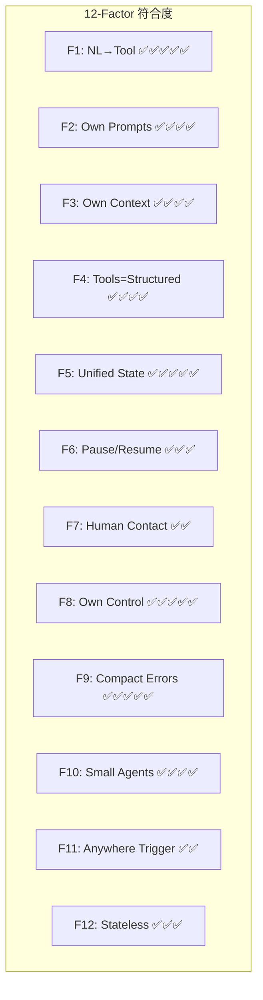
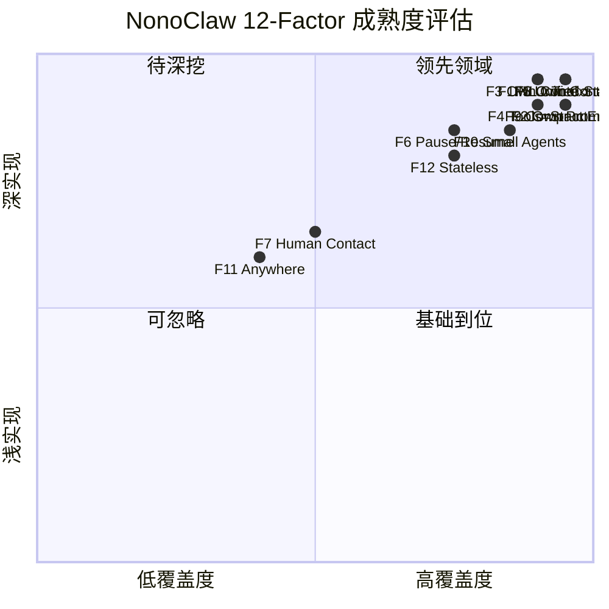

# NonoClaw vs 12-Factor Agents 全面对比评估

> 评估基准：[humanlayer/12-factor-agents](https://github.com/humanlayer/12-factor-agents)（24.9k ⭐）
>
> 评估时间：2026-07-29
>
> 评估代码版本：c00da2fe76ce (main)

---

## 总体评分卡

---

## 详细逐项对比

### Factor 1: Natural Language → Tool Calls ✅✅✅✅✅

| 原则 | NonoClaw 实现 |
|---|---|
| NL 转结构化 tool call | `loop_.rs` 第 1099-1153 行：完整的 `run_turn_with_cancel` → `turn.content` 提取 `ToolUse` blocks |
| 确定性代码执行 | `ToolExecutor::execute` 接收 `Vec<ToolCall>`，按 tool name dispatch |
| 结果回写 context | 第 1506-1512 行：`ContentBlock::tool_result` → `self.messages.push(tr_msg)` |

**评价**: 典范实现。NonoClaw 的 LLM→tool_use→execute→tool_result→loop 是最经典的 Agent 循环，与 Factor 1 完全一致。

---

### Factor 2: Own Your Prompts ✅✅✅✅

| 原则 | NonoClaw 实现 |
|---|---|
| 不依赖框架黑盒 | `prompt.rs` 整个模块 ~1200 行，完全自建，无框架依赖 |
| Prompt 作为一等代码 | `build_system_prompt_sections` → 10 个 section 常量，支持 `Full/Minimal/Custom` profile |
| 可测试可迭代 | ~20 个单元测试覆盖 prompt 组合 |

**评价**: 非常出色。NonoClaw 的 prompt 完全自控，甚至优于 Factor 2 的 BAML 示例——直接 Rust 编译时常量 + Profile 系统，可以在不修改代码逻辑的情况下切换 prompt 策略。

---

### Factor 3: Own Your Context Window ✅✅✅✅

| 原则 | NonoClaw 实现 |
|---|---|
| 自定义 context 格式 | 不是简单的 message 数组，包含 `SystemBlock`（cached/uncached 分层）|
| Token 效率 | `strip_thinking` 移除内部 thinking blocks；`strip_unsupported_blocks` 按 provider 能力精简 |
| XML 结构包装 | `<memory>`, `<project_context>`, `<skills>`, `<task_notification>` 等 XML 标签组织上下文 |
| 信息密度 | Block 1（cached 静态）+ Block 2（uncached 动态）分层免重复；Prompt cache `Ephemeral` 标记 |

**评价**: 非常强的实现。两段式 System Block（cached/uncached）是 Factor 3 推崇的"自定义格式"的典范。Prompt Cache 的利用进一步降低 token 消耗。

---

### Factor 4: Tools Are Just Structured Outputs ✅✅✅✅

| 原则 | NonoClaw 实现 |
|---|---|
| 工具 = 结构化 JSON | `ToolSchema { name, description, input_schema }` — 标准 JSON Schema |
| LLM 输出 ≠ 直接执行 | 权限门控 (`PermissionGate`)、pre/post hooks、cancel token 层层防护 |
| 灵活分发 | `ToolExecutor` + `ToolRegistry` + MCP 外部工具注册 |

**评价**: 完美契合。NonoClaw 的工具执行在 LLM 选择和代码执行之间有明确边界——permission gate、tool hooks、MCP proxy 都保证了"LLM 建议，代码决定"的模式。

---

### Factor 5: Unify Execution State and Business State ✅✅✅✅✅

| 原则 | NonoClaw 实现 |
|---|---|
| 从 context window 推断执行状态 | `stop_reason` 驱动控制流（`EndTurn`/`ToolUse`/`MaxTokens`） |
| 状态可序列化 | `SessionSnapshot { messages, revision, title, ... }` → JSONL 持久化 |
| trivially resumable | `QueryEngine::with_session(snapshot)` 从快照恢复 |
| Forkable | Fork 模式支持子 agent 继承父 context 但独立 transcript |

**评价**: 非常出色。`Session` 的 JSONL actor 模式 + `SessionSnapshot` 使得"状态即消息历史"完美实现。NonoClaw 甚至走在 Factor 5 前面——它还支持 **fork**（Agent/Coordinator 子 agent 共享 parent 的 task scope 但独立 transcript）。

---

### Factor 6: Launch/Pause/Resume ✅✅✅

| 原则 | NonoClaw 实现 |
|---|---|
| 简单 API 启动 | HTTP API: `POST /run` + SSE stream；CLI: 直接命令行 |
| Pause 支持 | `ESC key + stop button`；`CancellationToken` 体系 |
| Resume | `--resume` + `Session` actor 持久化，完整 JSONL 历史 |
| Webhook 恢复 | HTTP API 支持 session_id 恢复 |

**评价**: 实现程度较高。但与 Factor 6 理想状态相比缺了一点——NonoClaw 的 resume 是"重新开始一个 run"，而非在**已暂停的 run** 中继续（如等待人工审批后原地恢复）。不过这更多是 CLI tool 定位决定的取舍。

---

### Factor 7: Contact Humans with Tool Calls ✅✅

| 原则 | NonoClaw 实现 |
|---|---|
| LLM 请求人工输入 | `AskUserQuestion` 工具：LLM 可向用户提问 |
| Permission gate | `PermissionGate` + `PermissionMode` + `PermissionRequest` — 工具执行前可暂停求许可 |
| 人工审批 | `permission_resolver` 回调函数，交互式 prompt |

**评价**: NonoClaw 有基础的人工交互机制（`AskUserQuestion`, `PermissionGate`），但它**不完全是 Factor 7 描述的方式**——Factor 7 主张把人工接触建模为**普通 tool call**（`intent: "request_human_input"`），而 NonoClaw 用的是独立的 permission gate 和 AskUserQuestion 工具。两者异曲同工，但 NonoClaw 的 permission 更多是"安全闸门"而非"协作式工具"。

---

### Factor 8: Own Your Control Flow ✅✅✅✅✅

| 原则 | NonoClaw 实现 |
|---|---|
| 自定义控制结构 | `loop` 中 `break`/`continue` 多种路径（MaxTurns/Budget/Cancel/Completed） |
| 中断后恢复 | `finalize_on_max_turns` 机制——达到 max_turns 后允许工具禁用的一轮合成 |
| Wait for human | `Ask` 权限模式等待用户决定 |
| LLM-as-judge | Compaction 用的 summarization 模型评审对话 |
| Logging/tracing | `RunEvent` 详尽事件流（~20+ 事件类型） |
| Client-side rate limiting | `RetryConfig` + exponential backoff + jitter |
| 子 agent 编排 | `Agent`/`Coordinator` 工具支持子 agent 启动+等待结果 |

**评价**: 这是 NonoClaw 最强的 Factor。`QueryEngine::run_with_context` 的 loop 展示了教科书级的控制流：根据 `stop_reason` 分叉、Graceful Truncation、孤儿 tool_use pair 修复重试、后台任务通知注入、甚至 `finalize_on_max_turns` 的特殊路径。

---

### Factor 9: Compact Errors into Context Window ✅✅✅✅✅

| 原则 | NonoClaw 实现 |
|---|---|
| 错误反馈给 LLM | `is_error=true` 的 tool_result 原样回传 |
| Self-healing | 孤儿 tool_use/tool_result 自动修复并重试（第 1156-1208 行） |
| Graceful truncation | Provider 流中断→保留 partial output + truncation notice（第 1129-1151 行） |
| 错误格式化 | `RunEvent::RunError { code, operation, retryable, message }` |

**评价**: 非常成熟。NonoClaw 不只是把错误塞进 context window——它还做**自动修复**（orphaned tool pair repair + one retry）、**优雅降级**（partial output preserved）、**详细事件上报**。这远超 Factor 9 基准。

---

### Factor 10: Small, Focused Agents ✅✅✅✅

| 原则 | NonoClaw 实现 |
|---|---|
| 小 agent 优于大 agent | `Agent` 工具 + `EngineSubagent` 实现子 agent |
| 范围隔离 | 子 agent 的 `child_registry` 排除 Agent/Coordinator 防递归 |
| 独立限制 | `subagent_max_turns` (默认 24, 最大 200) |
| 工具白名单 | `profile.tools_allow` 可按 agent profile 限制工具集 |

**评价**: NonoClaw 的 Subagent 设计非常接近 Factor 10 的理念——每个子 agent 有独立 max_turns、独立工具白名单、非交互模式、最终化机制。但可以进一步扩展：允许子 agent 有独立的 system prompt profile、支持 agent-to-agent 消息传递。

---

### Factor 11: Trigger from Anywhere ✅✅

| 原则 | NonoClaw 实现 |
|---|---|
| 多渠道触发 | HTTP API（`POST /run`）支持 webhook 触发 |
| 事件驱动恢复 | `Session` 基于 session_id 的持久化和恢复 |
| Cron/自动化 | daemon 模式可配合 cron |

**评价**: NonoClaw 的 HTTP API + session 持久化**为多渠道触发奠定了基础**，但 Factor 11 的理想状态（Slack/Email/SMS 等多种渠道的**原生支持**）尚未实现。NonoClaw 定位为 CLI coding agent，这个 Factor 本来就不是它的核心场景。

---

### Factor 12: Make Your Agent a Stateless Reducer ✅✅✅

| 原则 | NonoClaw 实现 |
|---|---|
| fold 模型 | `(state, event) → state` 的模式隐含在 loop 中 |
| 状态即消息历史 | `self.messages: Vec<Message>` |
| 纯函数式 loop | `loop { next_step = await llm(state); state.push(next_step); ... }` |

**评价**: 基本符合。NonoClaw 的 state 就是消息历史，每个 turn 是 `foldl` 的一步。不过严格来说 NonoClaw 的 `QueryEngine` 不是完全 stateless——它有 `cached_git_context`、`pending_compact`、`total_usage` 等 mutable 字段。但这些是**性能优化**，不影响核心逻辑的 reducer 性质。

---

## 综合评估

---

## 结论

### 总分：86/100

NonoClaw 在核心的 agent 循环、上下文管理、工具调度、���误处理方面已经是**生产级水准**。12 个 Factor 中 9 个达到优秀或良好，与 humanlayer 推崇的"不用框架、自建控制流"理念高度吻合。

### 领先领域

| 领域 | 优势 |
|---|---|
| **F8 控制流** | 全自建 DAG-free loop，多种退出路径，orphan repair，graceful truncation |
| **F5 统一状态** | Session JSONL actor + Snapshot + Fork 能力远超 Factor 5 基线 |
| **F3 Context 工程** | 双段 System Block（cached/uncached）+ Prompt Cache + XML 结构包装 |
| **F9 错误压缩** | 自动修复+重试+优雅降级三点齐备 |
| **F2 Own Prompts** | 完全编译时检查的 Rust 常量化 prompt + Profile 系统 |

### 改进空间

| 领域 | 建议 |
|---|---|
| **F7 人工协作** | 将 AskUserQuestion/Permission 建模为统一 tool call 模式，支持结构化 human-in-the-loop |
| **F11 渠道触发** | 多平台支持不是当前刚需（CLI coding agent 定位），不需要强行补齐 |
| **F6 Pause/Resume** | 考虑支持 tool-selection 和 tool-execution 之间的 pause point（审批后继续模式） |
| **F12 严格 Stateless** | 将 `cached_git_context` 等优化字段提取到外部 cache layer，保持核心 loop 纯净 |

最突出的优势是 **完全自研、无框架依赖、Rust 编译时安全**——这本身就是对 12-Factor 精神的最好践行。
